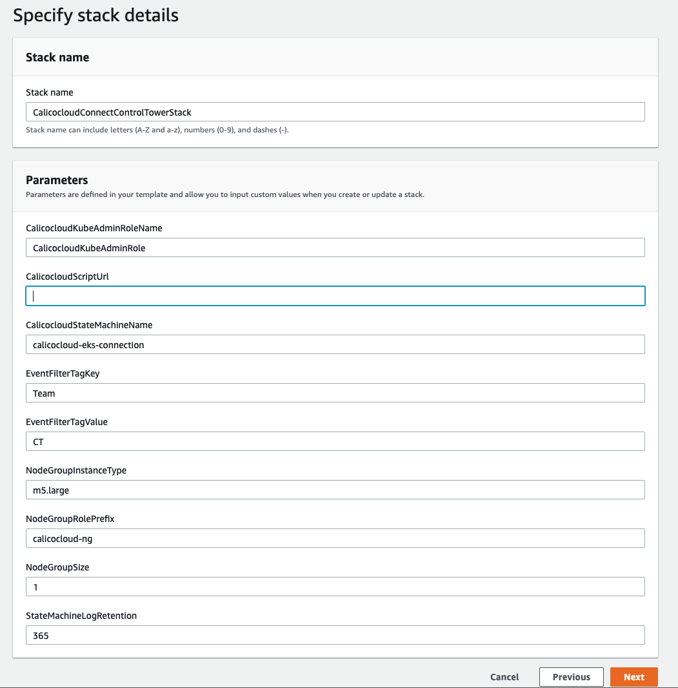

# tigera-controltower-solution

This solution provides an event driven automation to connect an EKS cluster with Calico cloud.

To connect an EKS cluster with Calico cloud, a user need to run a bash script provided in calico cloud account. This solutions aim to automate that process.

## Kubernetes access pre-requisite
In order to be able to perform operation on kubernetes, required by calicao script, this solution would need to get admin access on kubernetes. Access to kubernetes is managed via configmap; more details : https://docs.aws.amazon.com/eks/latest/userguide/add-user-role.html.
This solution create an IAM role which is used to perform operations on kubernetes. Users of this solution would need to have an automated way of getting that IAM role added as `system:masters` in aws-auth configmap.

## Deployment
The `ControlTowerCalicocloudStack.yml` will be deployed in Control Tower management account. This will create a stackset in management account. On every new account creation a CloudFormation stack will be deployed in new account via stackset. The CloudFormation stack in individual account(s) will deploy the resources required for tigera automation.

#### Create ControlTowerCalicocloudStack
* In Control Tower management account, go to CloudFormation stacks, select `Create stack` `With new resources (standard)`.
* Upload `ControlTowerCalicocloudStack.yml` template and select `Next`   

* on `Specify stack details` screen, provide a name for Stack. Provide install script url to connect EKS clusters to calico cloud under `TigeraScriptUrl` parameter. Update other parameters as desired. Then, select `Next`

* Keep default values and select `Next` on `Configure stack options` screen.
* On `Review` screen, select checkbox for `Capabilities` and select `Create stack`
* Once the stack is `CREATE_COMPLETE`, go to CloudFormation StackSets and select `TigeraCalicoConnnectStackSet`

* Now, if a new account is vended via Control Tower, a stack instance will be created for that account, which will deploy required resources for calico cloud eks connection automation. To add any existing account follow the `Add stacks to StackSet` action of `TigeraCalicoConnnectStackSet`.

## Resources - Tigera automation

#### Kubernetes admin IAM role   
This is the IAM role role that needs to be updated in aws-auth configmap of kubernetes cluster. ARN for this role is available as output of CloudFormation template.
#### Event bridge rule  
An event rule is created to capture EKS CreateCluster event. This rule then triggers the state machine to initiate the automation.
#### State machine   
This state machine will orchestrate the automation of connecting eks cluster to calico cloud. As part of this automation, a node group is added to EKS cluster as pods will be deployed. Then it uses AWS Systems Manager to run command on eks nodes to run the calico script.

## CloudFormation Parameters
* **TigeraKubeAdminRoleName**   
Role name for kubernetes admin role that needs to be added in aws-auth configmap.

*  **TigeraScriptUrl**   
The calico cloud install script url.

* **TigeraStateMachineName**   
State machine name, which orchestrate the automation.

* **StateMachineLogRetention**   
State machine log retention period.

* **NodeGroupRolePrefix**   
EKS node group role name prefix value. The node group role name would be `<NodeGroupRolePrefix>-<ClusterName>-role`.

* **NodeGroupInstanceType**   
EKS node group instance type. Default: `m5.large`

* **NodeGroupSize**   
Desired size for EKS node group, Default: 1

* **EventFilterTagKey**
Tag key name to filter event for EKS cluster creation.

* **EventFilterTagValue**
Tag key value to filter event for EKS cluster creation.
